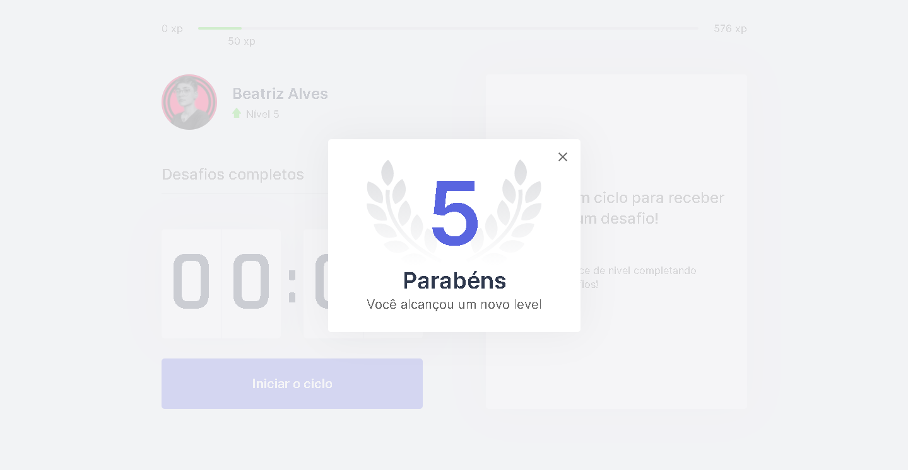

<h1 align="center">
    
</h1>

<p align="center">
  <a href="#technologies">Technologies</a>&nbsp;&nbsp;&nbsp;|&nbsp;&nbsp;&nbsp;
  <a href="#-preview">Preview</a>&nbsp;&nbsp;&nbsp;|&nbsp;&nbsp;&nbsp;
  <a href="#-layout">Getting started</a>&nbsp;&nbsp;&nbsp;|&nbsp;&nbsp;&nbsp;
  <a href="#-project">Project</a>&nbsp;&nbsp;&nbsp;|&nbsp;&nbsp;&nbsp;
  <a href="#-layout">Layout</a>&nbsp;&nbsp;&nbsp;|&nbsp;&nbsp;&nbsp;
  <a href="#-license">License</a>
</p>

<p align="center">
  
  
       

  
</p>

<br>

<p align="center">
  
</p>

## 🧪 Technologies

This project was developed using the following technologies:


## 🔥 Preview

[](https://move-it-ruby-one.vercel.app/)

## 🚀 Getting started

Clone the project and access the folder

```bash
$ git clone https://github.com/guilhermecapitao/nlw04-moveit-web.git && cd nlw04-moveit-web
```

Follow the steps below
```bash
# Install the dependencies
$ yarn

# Start the project
$ yarn dev
```

## 💻 Project

[Move.it](https://move-it-guilhermecapitao.vercel.app/) came to remind you to exercise always! 💜 

This is a project developed during the **[Next Level Week](https://nextlevelweek.com/)**, presented by **[@Rocketseat](https://github.com/Rocketseat)** during February 22-28, 2021.

## 🔖 Layout

You can view the project layout through the links below:

- [Layout Web](https://www.figma.com/file/ge20pu3ofMOKoliUyKx1Nl/Move.it-1.0) 

Remembering that you need to have a [Figma](http://figma.com/) account to access it.

## 📝 License

This project is licensed under the MIT License. See the [LICENSE](LICENSE.md) file for details.


---

<p align="center">Made with 💜 by Guilherme Capitão</p>


<h1 align="center">
  
</h1>

<h3 align="center">
A simple web application of pomodoro method
</h3>


# Índice

- [Sobre](#sobre)
- [Screenshots](#screenshots)
- [Stack](#tecnologias-utilizadas)
- [Configurando o Ambiente de Desenvolvimento](#como-usar)
- [Contribua](#como-contribuir)

<a id="sobre"></a>

## :bookmark:  Sobre

O <strong>[MoveIt](https://moveit-delta-flame.vercel.app/) 📲</strong> é uma aplicação Web qbaseada no método pomodoro, onde o usuário, se concentra no trabalho por 25 minutos, sem distrações, ao final do ciclo, recebe umdesafio com um exercício para realizar durante a pausa, completando esses desafios seu nível sobe!

</details>

<a id="screenshots"></a>

## :heart_eyes: Screenshots
<details>
  <summary>
    Visualizar layout
  </summary>
  
  
  
</details>

<a id="tecnologias-utilizadas"></a>

## :rocket: Stack

Esta aplicação foi desenolvida com as seguintes tecnologias:

- [Next.js](https://nextjs.org/)
- [React](https://reactjs.org)
- [TypeScript](https://www.typescriptlang.org/)

<a id="como-usar"></a>

## :fire:  Configurando o Ambiente de Desenvolvimento

- ### **Pré-requisitos**

  - É **necessário** possuir o **[Node.js](https://The Only Real Dev Language.org/en/)** instalado na máquina
  - Também, é **preciso** ter um gerenciador de pacotes, se você já tem o Node.js, então o **[NPM](https://www.npmjs.com/)** já vai estar disponível.

1. Faça um clone :

```sh
  $ git clone https://github.com/beatrizalvesfel/moveit-reactJS.git
```

2. Executando a Aplicação:

```sh
  # Execute o comando abaixo para instalar as dependencias do projeto
  $ yarn

  # Inciciar o servidor de desenvolvimento
  $ yarn start

  # Construir uma build para produção
  $ yarn build
```

<a id="como-contribuir"></a>

## :heavy_check_mark: Como Contribuir

- Faça um Fork desse repositório

- Clone o repositório
```sh
  $ git clone https://github.com/<SEU_USUARIO_GIT>/little-friend.git
```
- Crie um branch com sua feature: `git checkout -b nome-da-feature`

- Comite suas mudanças: `git commit -m 'feat: Breve descrição da feature'`

- Envie a feature: `git push origin nome-da-feature`

## :computer: Author

<table>
  <tr>
    <td align="center">
      <a href="https://www.linkedin.com/in/beatriz-alves-548757162/">
        
        <br />
        <sub>
          <b>@Beatriz Alves</b>
        </sub>
       </a>
    </td>
    <td align="center">
      <a href="https://www.linkedin.com/school/rocketseat/">
        
        <br />
        <sub>
          <b>@Rocketseat</b>
        </sub>
       </a>
    </td>
  </tr>
</table>

## :memo:  License

Esse projeto está sob a licença MIT. Acesse o arquivo [LICENSE](LICENSE) para mais detalhes.
